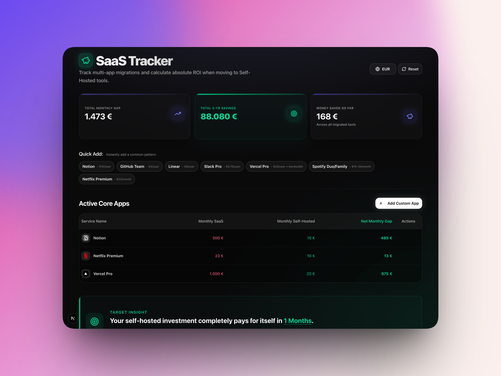
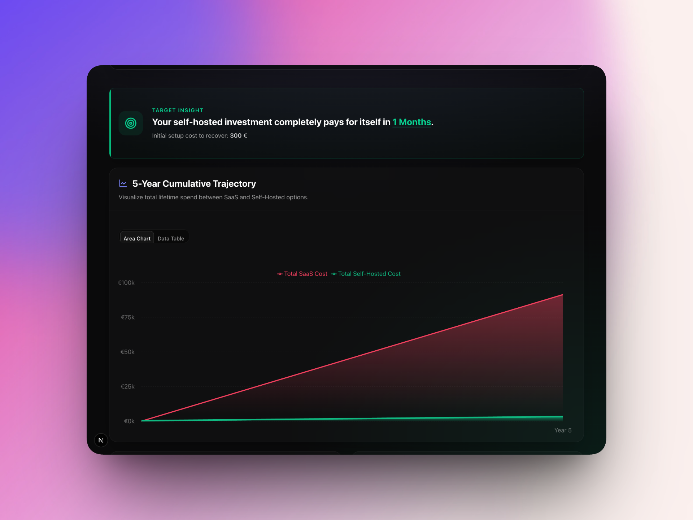
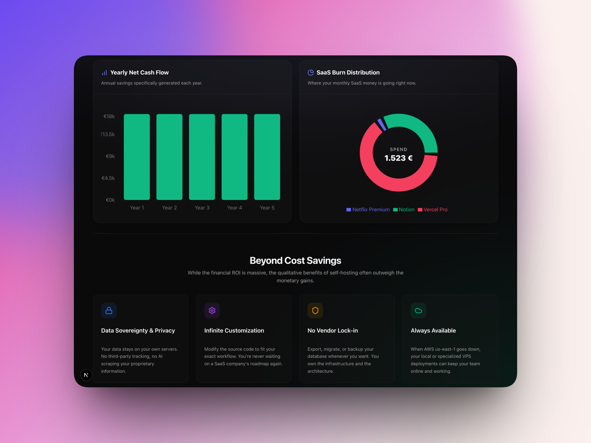

<div align="center">
  <h1>SaaS Savings & ROI Calculator 🧮</h1>
  <p><strong>A dynamic, visual Next.js dashboard to calculate the exact ROI and break-even point when migrating from per-user SaaS tools to self-hosted infrastructure.</strong></p>
  
  [](https://opensource.org/licenses/MIT)
  [](https://nextjs.org/)
  [](https://tailwindcss.com/)
  <br />
</div>

---

## 📸 The Dashboard

<div align="center">
  
</div>

Stop bleeding recurring revenue on scaling per-seat licenses. **SaaS Tracker** provides the absolute mathematical proof and deep financial visualizations you need to confidently switch to fixed-cost IT infrastructure.

### 🌟 Key Features

- **💸 Exact ROI & Break-Even Analysis:** Calculate 1, 3, and 5-year savings. Automatically find the exact month your self-hosted setup costs pay for themselves.
- **📈 Advanced Financial Visualizations:** Interactive Recharts elements including 5-Year Cumulative cost trajectories, Yearly Net Cash Flow bar charts, and SaaS Burn Distribution donuts.
- **⚡ Zero-Cost Infra Support:** Toggle recurring VPS costs off for apps deploying onto shared or existing internal hardware.
- **💾 Local Storage Persistence:** Your tracking completely auto-saves to your browser. Close the tab and never lose your configurations.
- **🌍 EUR & USD Currency Switching:** Built-in localization to swap instantaneously between Dollar and Euro syntax.

---

<div align="center">
  
  
</div>

## 🚀 Quick Start

This project runs on the modern React framework (Next.js 14+) and is optimized for 1-click deployments.

### Deploy to Vercel
Host your own tracker instantly for free:

[](https://vercel.com/new/clone?repository-url=https%3A%2F%2Fgithub.com%2Fyourusername%2Fsaas-calculator)

### Run Locally

1. **Clone it down:**
   ```bash
   git clone https://github.com/yourusername/saas-calculator.git
   cd saas-calculator
   ```

2. **Install & Run:**
   ```bash
   npm install && npm run dev
   ```

3. **View the Dashboard:** Navigate to [localhost:3000](http://localhost:3000)

## 🛠️ Tech Stack
- **[Next.js App Router](https://nextjs.org/)** — React framework
- **[Tailwind CSS](https://tailwindcss.com/)** — Utility-first styling
- **[shadcn/ui](https://ui.shadcn.com/)** — Accessible component primitives
- **[Recharts](https://recharts.org/)** — Composable charting library
- **[Framer Motion](https://www.framer.com/motion/)** — Gesture and animation library

## 🤝 Contributing & License
Contributions, bug reports, and exciting SaaS templates are welcome! Open an issue or submit a PR.

Released under the [MIT License](LICENSE).
