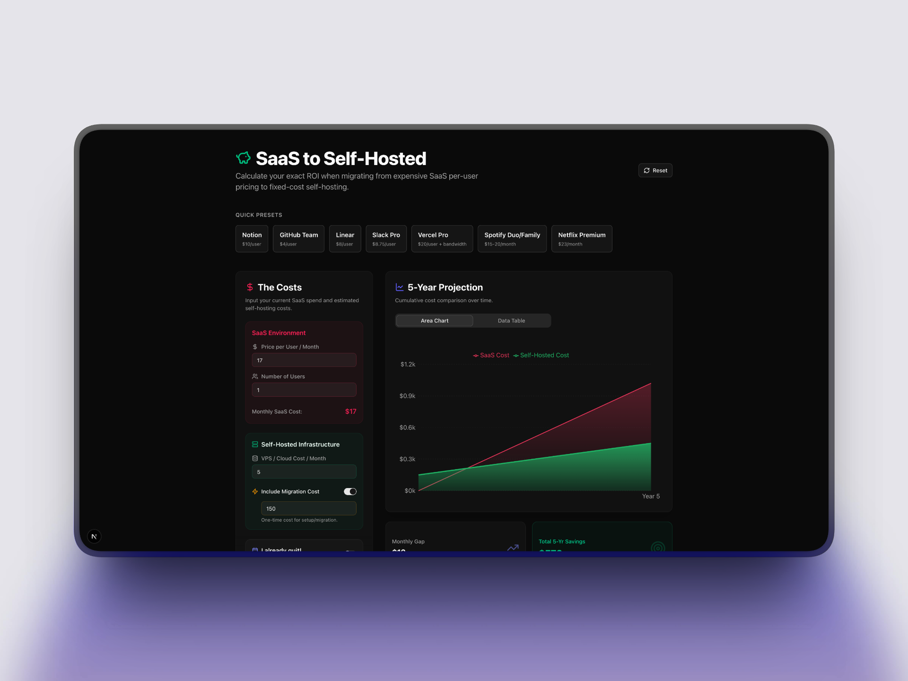
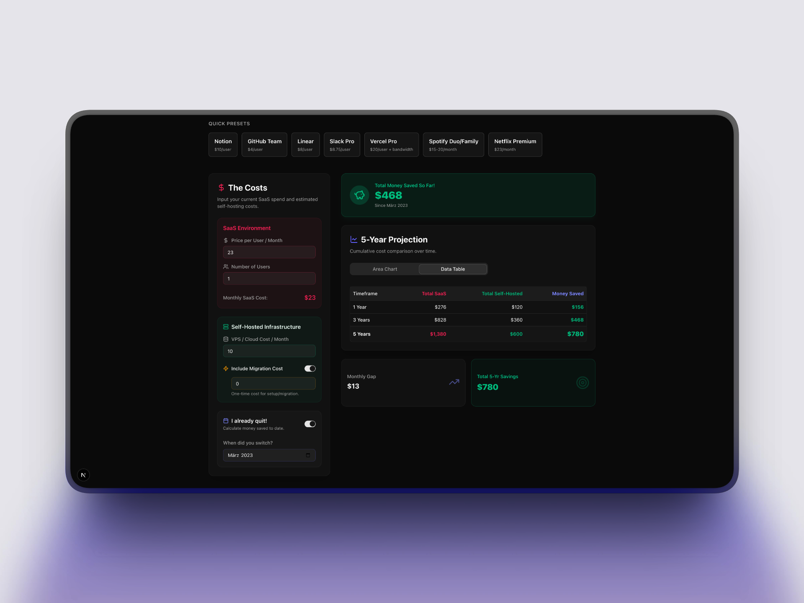

<div align="center">
  <h1>SaaS vs. Self-Hosted Savings Calculator 🧮</h1>
  <p>A beautiful, highly visual Next.js application to calculate and plot the exact ROI of migrating from per-user SaaS tools to fixed-cost self-hosted infrastructure.</p>
  
  [](https://opensource.org/licenses/MIT)
  [](https://nextjs.org/)
  [](https://tailwindcss.com/)
  <br />
</div>

---

## 📸 The Application

<div align="center">
  
</div>

Why continue paying scaling per-seat licenses when you could own your infrastructure? This application provides the mathematical proof and visual projections to help you (or your management team) make the switch.

### 🌟 Key Features

- **💸 Exact ROI Calculations:** Input your current SaaS spend and estimated VPS costs to see exact 1, 3, and 5-year savings.
- **📈 Beautiful Projections:** Built with Recharts, the Area Chart plots the growing gap between compound SaaS costs and flat self-hosted hardware limits.
- **⚡ Quick Presets:** 1-click templates for popular tool swaps (Notion, GitHub Team, Linear, Slack Pro, Vercel).
- **⏳ Retrospective Mode ("I already quit!"):** Input the date you successfully migrated and see a live-counter of the money you've saved *to date*.
- **🕶️ Premium Aesthetic:** Dark mode by default, featuring a sleek slate layout with vibrant Emerald (Savings) and Rose (Expenses) accents. 

---

<div align="center">
  
  <p><em>Calculate your historical savings instantly.</em></p>
</div>

## 🚀 Quick Start & Deployment

This project is built using the Next.js App Router and perfectly suited for 1-click deployment on **Vercel**.

### Deploy to Vercel

The easiest way to host this open-source calculator is via Vercel:

[](https://vercel.com/new/clone?repository-url=https%3A%2F%2Fgithub.com%2Fyourusername%2Fsaas-calculator)

1. Fork/Clone this repository.
2. Connect your GitHub account to Vercel.
3. Import the repository and hit Deploy. It works out of the box with zero configuration needed!

### Run Locally

1. **Clone the repository:**
   ```bash
   git clone https://github.com/yourusername/saas-calculator.git
   cd saas-calculator
   ```

2. **Install dependencies:**
   ```bash
   npm install
   ```

3. **Start the development server:**
   ```bash
   npm run dev
   ```

4. **Open your browser:** Navigate to [http://localhost:3000](http://localhost:3000) to view the app.

## 🛠️ Built With
- **[Next.js](https://nextjs.org/)** (App Router)
- **[Tailwind CSS](https://tailwindcss.com/)** (Styling)
- **[shadcn/ui](https://ui.shadcn.com/)** (Component Primitives)
- **[Recharts](https://recharts.org/)** (Data Visualization)
- **[Lucide React](https://lucide.dev/)** (Iconography)
- **[Framer Motion](https://www.framer.com/motion/)** (Micro-animations)

## 🤝 Contributing
Contributions, issues, and feature requests are welcome!
Feel free to check out the [issues page](https://github.com/yourusername/saas-calculator/issues). 

If you add a new SaaS preset mapping in `src/components/calculator/SaasTemplateCards.tsx`, please submit a PR!

## 📜 License
This project is open-source and available under the [MIT License](LICENSE).
